# LV3 파이널 미션 수행

상태: 시작 전
태그: LV4

애플리케이션을 AWS에 배포 가능한 상태로 구축해야 한다.

→ EC2를 활용해서 서버에 배포한다.

애플리케이션 서버와 데이터베이스 서버를 물리·네트워크 계층에서 분리해야 한다.

→ Docker-compose를 활용해서 mysql 컨테이너를 만들고 처리한다.

• 개발(dev)과 운영(prod)의 설정을 서로 독립적으로 관리·배포해야 한다.

dev 환경에서는 h2 데이터 베이스를 활용해서 처리하고.

prod 환경에서는 mysql 3306 포트를 연결해서 처리한다.

이 때, prod 환경에서는 create-drop을 하지 않는다.  none을 사용하고 prod에서는 create-drop을 사용한다.

# 코드 초기화

먼저 H2를 사용하였으므로  MySQL로 전환해서 처리한다. 또한 데이터베이스와 서버 분리를 하기 위해 Docker를 사용해서 관리하도록 수정한다. 

```powershell
> 데이터베이스를 docker compose를 통해서 mysql에 연결할 수 있도록 설정을 해줘. 이 때, application.yml 파일도 mysql을 사용해서 처리할 수 있도록 변경을 해줘. 또한 환경 분리를 해야해. dev 환경에서는 h2 데이터 베이스를 활용해서 처리하고.

  prod 환경에서는 mysql 3306 포트를 연결해서 처리한다.

  이 때, prod 환경에서는 create-drop을 하지 않는다.  none을 사용하고 prod에서는 create-drop을 사용한다.
```

ai가 생성한 docker-compose에서는 3306 외부 포트를 사용하나 이미 mysql 서버가 있으므로 33061 포트로 변경해서 처리한다.

dev에서는 h2를 처리하고, sql 쿼리문을 볼 수 있도록 하였다.

# 배포 환경 구축하기

## self-hosted github actions

빠른 개설을 위해 self-hosted github actions로 처리한다. codepipeline 구축보다 더 빠르게 할 수 있을 거 같다.

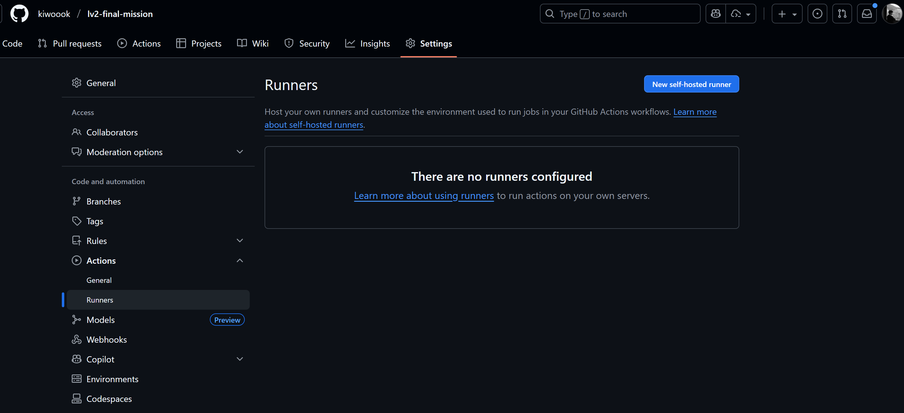

현재 ec2 환경은 arm64 환경에서 처리하게 되므로 아래에 맞춰서 작동한다.

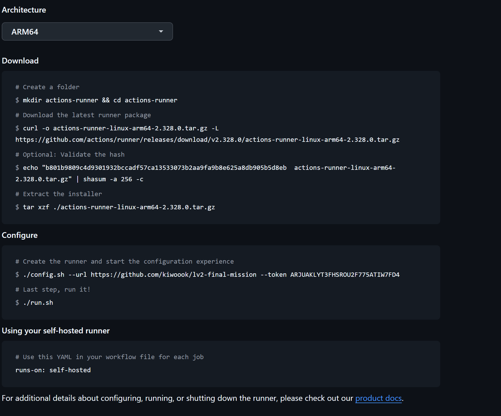

### 트러블 슈팅

ec2에서 퍼블릭 IP가 할당되지 않는 문제가 발생했는데 퍼블릭 iP 자동 할당을 켜서 해결하였다.

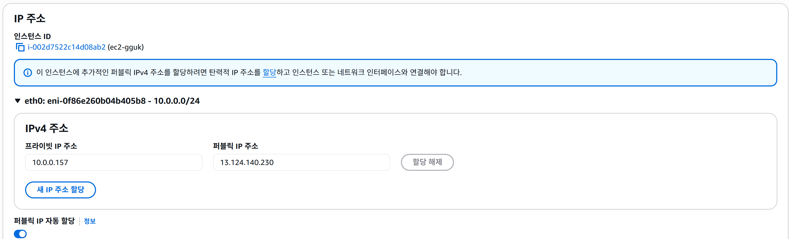

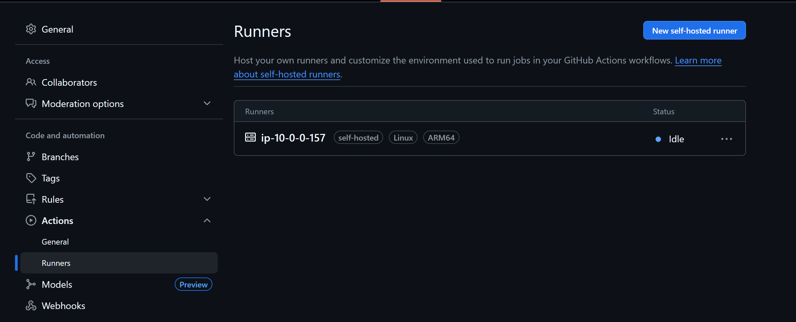

해당 코드가 동작되는 것을 확인했다.

## Docker-compose와 spring 실행 환경 구성하기

```powershell
ec2 환경에서 docker compose와 java를 사용할 수 있는 환경 명령어를 알려줄래? 운영체제 환경은 arm64야
```

Docker 설치

```powershell
// HTTPS 저장소 사용 설정 추가
sudo apt install ca-certificates curl gnupg lsb-release -y

// DOCKER GPG키 사용, 패키지 진위 확인
sudo mkdir -p /etc/apt/keyrings
curl -fsSL https://download.docker.com/linux/ubuntu/gpg | sudo gpg --dearmor -o /etc/apt/keyrings/docker.gpg

// DOCKER 저장소 추가
echo "deb [arch=$(dpkg --print-architecture) signed-by=/etc/apt/keyrings/docker.gpg] https://download.docker.com/linux/ubuntu $(lsb_release -cs) stable" | sudo tee /etc/apt/sources.list.d/docker.list > /dev/null

// DOCKER 설치
sudo apt update
sudo apt install docker-ce docker-ce-cli containerd.io docker-buildx-plugin docker-compose-plugin -y

// DOCKER 그룹 추가 (SUDO 없이 사용 가능)
sudo usermod -aG docker $USER
newgrp docker
```

Java 설치

```powershell
sudo apt update
sudo apt install openjdk-21-jdk -y
```

# Github Actions Workflow 활용

github actions workflow 파일을 생성해서 변경 사항이 발생되면 CI CD가 될 수 있도록 구성한다.

```powershell
│ > 현재 github actions self-hosted를 통해서 ec2 환경에서 CI CD가 될 수 있도록 만들려고 해 현재 self-hosted로 인한 서버 연결은 성공적으로 마무리되었어. actions 파일을 만들어서 동작할 수 있도록 구성을 해주면 될 거 같아.                                           │

```

AI를 통해 Spring Actulator와 yml 스크립트 파일을 구성했다.

```powershell
name: CI/CD Pipeline

on:
  push:
    branches: [ main, develop ]
  pull_request:
    branches: [ main ]

jobs:
  test:
    runs-on: self-hosted
    
    steps:
    - name: Checkout code
      uses: actions/checkout@v4

    - name: Set up JDK 21
      uses: actions/setup-java@v4
      with:
        java-version: '21'
        distribution: 'temurin'

    - name: Cache Gradle packages
      uses: actions/cache@v4
      with:
        path: |
          ~/.gradle/caches
          ~/.gradle/wrapper
        key: ${{ runner.os }}-gradle-${{ hashFiles('**/*.gradle*', '**/gradle-wrapper.properties') }}
        restore-keys: |
          ${{ runner.os }}-gradle-

    - name: Grant execute permission for gradlew
      run: chmod +x gradlew

    - name: Run tests
      run: ./gradlew test

    - name: Upload test results
      uses: actions/upload-artifact@v4
      if: always()
      with:
        name: test-results
        path: build/test-results/test/

  build-and-deploy:
    runs-on: self-hosted
    needs: test
    if: github.ref == 'refs/heads/main'
    
    steps:
    - name: Checkout code
      uses: actions/checkout@v4

    - name: Set up JDK 21
      uses: actions/setup-java@v4
      with:
        java-version: '21'
        distribution: 'temurin'

    - name: Cache Gradle packages
      uses: actions/cache@v4
      with:
        path: |
          ~/.gradle/caches
          ~/.gradle/wrapper
        key: ${{ runner.os }}-gradle-${{ hashFiles('**/*.gradle*', '**/gradle-wrapper.properties') }}
        restore-keys: |
          ${{ runner.os }}-gradle-

    - name: Grant execute permission for gradlew
      run: chmod +x gradlew

    - name: Build application
      run: ./gradlew build -x test

    - name: Stop existing application
      run: |
        PID=$(pgrep -f "lv2-final-mission" || echo "")
        if [ ! -z "$PID" ]; then
          echo "Stopping existing application with PID: $PID"
          kill -15 $PID
          sleep 10
          if kill -0 $PID 2>/dev/null; then
            echo "Forcefully killing application"
            kill -9 $PID
          fi
        else
          echo "No existing application found"
        fi

    - name: Start Docker Compose
      run: |
        docker-compose down || true
        docker-compose up -d

    - name: Wait for MySQL to be ready
      run: |
        echo "Waiting for MySQL to be ready..."
        while ! docker exec lv2-final-mission-mysql mysqladmin ping -h"localhost" --silent; do
          echo "MySQL is not ready yet, waiting..."
          sleep 5
        done
        echo "MySQL is ready!"

    - name: Deploy application
      run: |
        cd build/libs
        nohup java -jar -Dspring.profiles.active=prod *.jar > /dev/null 2>&1 &
        echo "Application deployed successfully"

    - name: Health check
      run: |
        sleep 5
        curl -f http://localhost:8080/actuator/health || echo "Health check failed, but continuing..."

```

### 트러블 슈팅

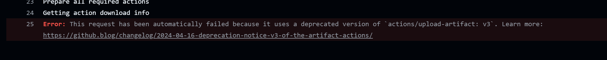

기존에 코드는 v3 버젼을 사용하는데, deprecated 되었으므로 v4 버젼을 통해서 해결했다.

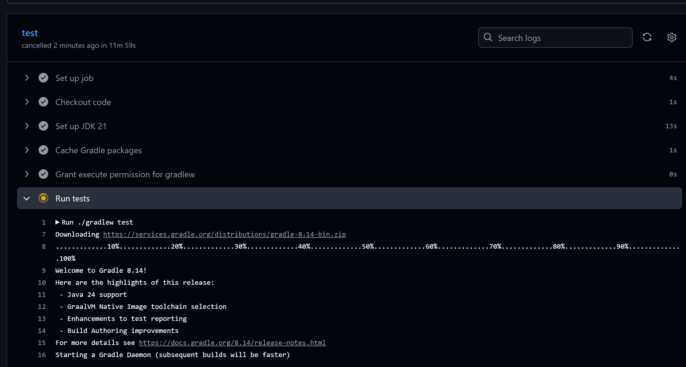

11분간 gradle test에서 넘어가지 못했다. 인스턴스의 성능(T4g.micro) 때문에 발생했던 것으로 보인다. 이를 해결하기 위해 t4g.small로 업그레이드하는 과정을 거쳤다.

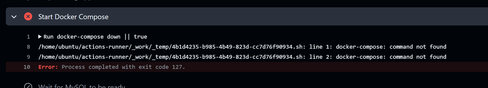

docker-compose 명령어가 아닌 docker compose로 실행되도록 변경하였다.

### plain-jar 파일 사용 수정

plain-jar 파일을 실행하게 되어 문제가 발생하였다.

해당 코드를 다음과 같이 변경하였다.

```powershell
        JAR_FILE=$(ls lv2-final-mission-*.jar | grep -v plain)
        nohup java -jar -Dspring.profiles.active=prod $JAR_FILE > /dev/null 2>&1 &
```

## 배포 완료 및 Nginx 구축

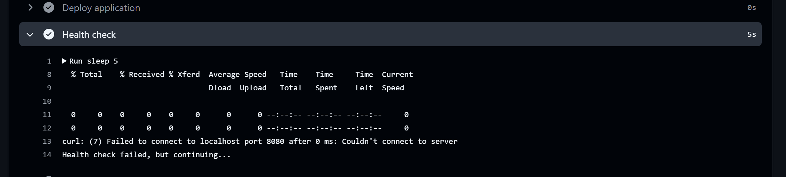

배포가 되었지만,  현재 실제 접근을 하여 확인할 수가 없다. 

Spring 서버는 8080이지만, HTTP 연결에서는 80포트를 사용으로만 접근을 할 수 있기 때문이다.

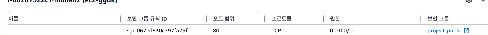

이를 해결하기 위해 리버스 프록시 툴인 Nginx를 활용해서 처리한다. nginx를 통해 적용할 수 있게 한다.

nginx 설치

```powershell
sudo apt install nginx -y
```

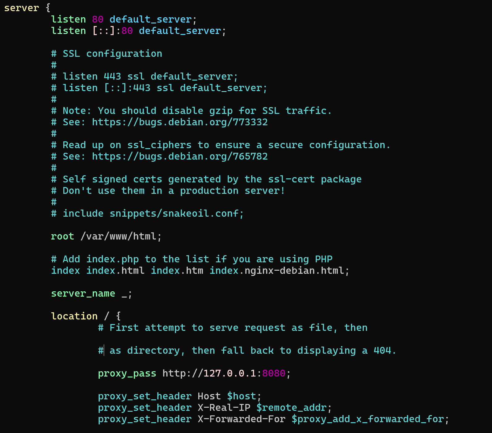

80 포트에 대해서 8080 포트로 갈 수 있도록 설정을 하였다.

# 개발, 운영 환경 분리하기

현재는 브랜치를 통해서 dev와 prod를 따로 동작할 수 있도록 해야 한다.

현재는 ec2를 한 개를 동작하게 하고 같은 설정을 사용하면 문제가 발생할 수 있으므로, 다른 폴더와 포트를 사용할 수 있도록 설정한다.

```powershell
현재 다음과 같은 workflow를 만들어야해 dev와 prod 브랜치에 따라서 파일을 분리하고 각자 다른 포트로 실행될 수 있게끔해야해 prod는 8080 dev는 8081 포트로 연결될 수 있게끔 변경해줘          
```

AI가 해당 파일을 하나로 처리하므로 cd에 대한 dev와 prod를 분리할 수 있도록 하였다

```powershell
ci cd 파이프라인을 dev와 prod에 따라 분리한다면 더 나을 거 같은데 이에 대해서 어떻게 생각해        
```

ci 파일에 대해서는 공통적으로 동작하고, 브랜치가 prod인지 dev인지에 따라서 동작할 수 있도록 하였다.

prod에서는 정상 동작하는 것을 확인하였다.

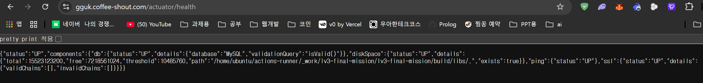

dev에서도 동작되는지 체크하였다.

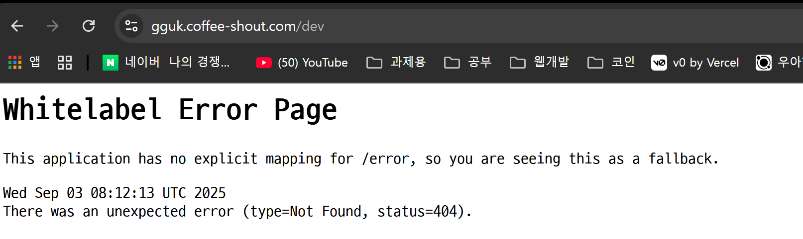

# HTTPS 설정하기

내 도메인에다가 A레코드로 ec2 ip 포트를 연결시킨다.


CertBot을 활용해서 자동적으로 HTTPS가 될 수 있도록 구축한다.

```powershell
sudo apt install certbot python3-certbot-nginx
sudo certbot --nginx -d gguk.coffee-shout.com

```

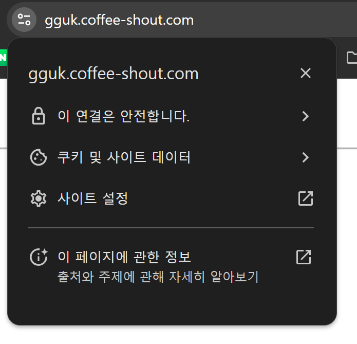

# 지표 대시보드 만들기

aws cloudwatch agent를 활용해서 메모리와 디스크도 볼 수 있도록 수정하였다.

```powershell
wget https://s3.amazonaws.com/amazoncloudwatch-agent/debian/amd64/latest/amazon-cloudwatch-agent.deb
sudo dpkg -i -E ./amazon-cloudwatch-agent.deb
```

```powershell
sudo /opt/aws/amazon-cloudwatch-agent/bin/amazon-cloudwatch-agent-config-wizard
```

해당 설정으로 필요한 것을 가져온다.